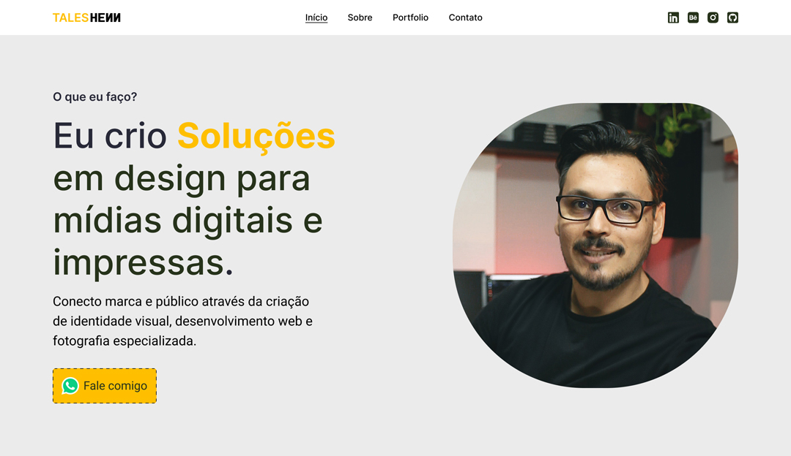
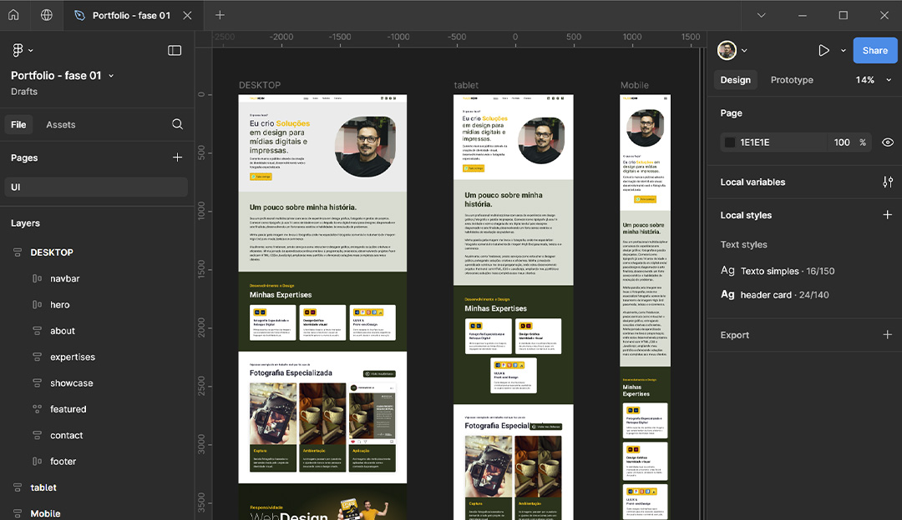
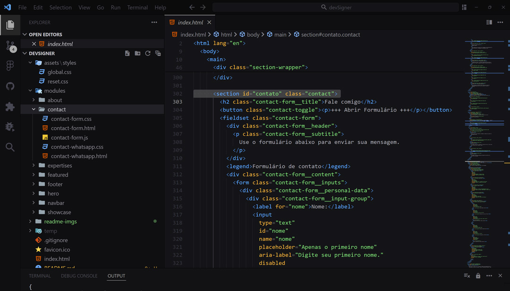

<p align="center">
  
</p>

## README.md

### Projeto SneakPick (Loja de Tênis (Sneakers))

**Conceito:** Criação de uma landing page para uma loja de tênis fictícia.

**Objetivo:**
Fixar os conhecimentos em HTML e CSS puro através da prática na intenção de fixar a sintaxe e conceitos, criando uma base mais sólida sobre o funcionamento dessas tecnologias.

#### Design

O design é minimalista e moderno, com uma paleta de cores predominantemente em preto, amarelo e branco, fontes de fácil leitura. O foco está em criar uma experiência visual clean e intuitiva para o usuário.

<p align="center">
  
</p>

#### Ferramentas e Tecnologias

- **Design:**

  - **Figma:** Prototipação, design responsivo.
  - **Adobe Photoshop:** Criação dos elementos visuais e assets.
  - **Adobe Firefly:** Geração das imagens de tênis através de inteligencia artificial (texto para imagem).
  - **Adobe Illustrator:** Otimização do layout e criação de estrutura vetorial usada no Figma. A escolha do Illustrator garantiu a possibilidade de exportar para o formato SVG mantendo a qualidade dos "assets".

<p align="center">
  
</p>
<p align="center">
  Foram muitos prompts até chegar nas imagens do projeto.
</p>

- **Desenvolvimento:**
  - **HTML5:** Estrutura semântica da página.
  - **CSS3:** Estilização visual, responsividade e efeitos visuais.

**Observações:**

- A escolha do fluxo de trabalho Photoshop -> Illustrator -> Figma permitiu uma transição suave entre as ferramentas, mantendo a qualidade dos elementos visuais e a flexibilidade do design.
- O formato SVG foi escolhido para todos os gráficos por garantir alta qualidade, escalabilidade e menor tamanho de arquivo, otimizando o desempenho da página.

## Funcionalidades

- **Responsividade:** Layout adaptável para diferentes dispositivos (mobile, tablet, desktop).
- **Animações:** Efeitos visuais em loop nas imagens dos produtos em destaque.
- **Interatividade:** Troca dinâmica de imagens e nomes de produtos ao passar o mouse sobre os ícones.

## Deploy e Repo

1. **Acesse e depois me diga o que achou**

Acessar o [Deploy](https://link-in-bio-two-themes.vercel.app/)

2. **Clone o Repositório**
   Faça um clone do repositório para sua máquina local. Você pode usar o comando Git:
   ```bash
   git clone https://github.com/taleshenn/linkInBioTwoThemes.git
   ```

## Resumo do Código HTML

- A estrutura é organizada em seções claras, facilitando a navegação e interação.

<p align="center">
  
</p>

- **Estrutura Básica**: Documento HTML5 com configuração para responsividade e inclusão de fontes do Google.
- **Semântica**: Uma boa prática e um padrão nos meus arquivos.
- **Modularização**: cada seção tem sua estrutura básica dividida em diretórios (pra imagens) e aquivos base (nesse caso .css) que ficam dentro do diretório "assets". Essa organização facilita a manutenção do projeto.

## Estrutura Geral do CSS

Optei por componentização para garantir que o site seja visualmente atraente e funcional enquanto mantém a consistência e a escalabilidade.

<p align="center">
  
</p>

### **Reset e Estilos Básicos**

Comecei com um reset básico para garantir que todos os elementos sejam exibidos de maneira consistente em diferentes navegadores. Isso remove margens, bordas e padding padrão e ajusta o `box-sizing` para garantir que padding e borda sejam incluídos no cálculo da largura e altura dos elementos. Links são estilizados para não ter sublinhado e herdar a cor do texto do elemento pai.

### **Uso de Variáveis de CSS**

Utilizei variáveis no `:root` para definir cores, imagens, parâmetros de transições que podem ser facilmente ajustadas para suportar diferentes temas.
