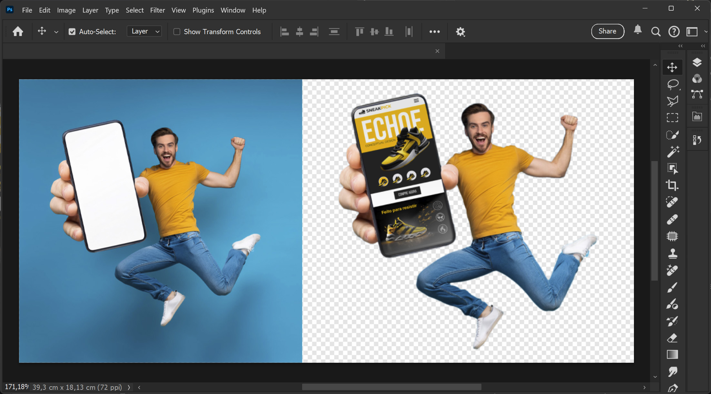

<p align="center">
  
</p>

## README.md

### Projeto Perfil DevDesigner

**Conceito:** Criação de uma landing page para meu perfil como Designer Gráfico, UX/UI e Desenvolvedor Front-end.

**Objetivo:**
Solidificar conhecimentos em HTML e CSS puro através da prática na intenção de fixar a sintaxe e conceitos, criando uma base permanente sobre o funcionamento dessas tecnologias.

#### Design

O design é minimalista e moderno, com uma paleta de cores predominantemente claras e leves, fontes de fácil leitura. O foco está em criar uma experiência visual clean e intuitiva para o usuário.

<p align="center">
  
</p>

#### Ferramentas e Tecnologias

- **Design:**

  - **Figma:** Design e responsividade.
  - **Adobe Firefly:** Geração das imagens de apoio através de inteligencia artificial (texto para imagem).
  - **Adobe Photoshop:** Mockup e adequação dos elementos visuais e assets.

<p align="center">
  
</p>
<p align="center" style="color: #FF9A00;">
  Imagem criada mo Firefly e editada no Photoshop.
</p>

- **Desenvolvimento:**
  - **HTML5:** Estrutura semântica da página.
  - **CSS3:** Estilização visual, responsividade e efeitos visuais.
  - **Javascript** Interatividade com elementos da landing page (menu mobile, seção contato colapsável).

## Funcionalidades

- **Responsividade:** Layout adaptável para diferentes dispositivos (mobile, tablet, desktop).
- **Interatividade:** Menu mobile e Seção contato possuem interatividades que só eram possíveis através de uso do javascript.

## Deploy e Repo

1. **Acesse e depois me diga o que achou**

Acessar o [Deploy](https://designer-dev-profile.vercel.app/)

2. **Clone o Repositório**
   Faça um clone do repositório para sua máquina local. Você pode usar o comando Git:
   ```bash
   git clone https://github.com/taleshenn/devSignerPorfolio.git
   ```

## Resumo do Código HTML e CSS

- A estrutura HTML é organizada em seções claras, facilitando a navegação e interação.
- Estruturado de forma modular para garantir que o site seja visualmente atraente e funcional enquanto mantém a consistência e a escalabilidade.

<p align="center">
  
</p>

- **Estrutura Básica**: Documento HTML5 com configuração para responsividade e inclusão de fontes do Google.
- **Semântica**: Uma boa prática e um padrão nos meus arquivos.
- **Modularização**: cada seção tem sua estrutura individual visando a fácil reutilização em outros trabalhos além de agilizar a manutenção do projeto.

### **Reset e Estilos Básicos**

- reset.css

Comecei com um reset básico para garantir que todos os elementos sejam exibidos de maneira consistente em diferentes navegadores. Isso remove margens, bordas e padding padrão e ajusta o `box-sizing` para garantir que padding e borda sejam incluídos no cálculo da largura e altura dos elementos. Links são estilizados para não ter sublinhado e herdar a cor do texto do elemento pai.

### **Uso de Variáveis de CSS**

- global.css

Utilizei variáveis no `:root` para definir cores, imagens, parâmetros de transições que podem ser facilmente ajustadas para suportar diferentes temas.
